# BOOKIFY

## 👥 Group Members
| Fist name and Last name | URJC mail | GitHub User |
|:--- |:--- |:--- |
| Mengying Xia Ruan | m.xia.2023@alumnos.urjc.es | Mengying04 |
| Jonás Aquiles Huertes Ramirez | ja.huertes.2023@alumnos.urjc.es | jonass-hr |
| Adrián Aranda Martínez | a.arandam.2021@alumnos.urjc.es | Adrian24864 |

---

## 🎭 **Preparation: Project Definition**

### **Subject Description**
It is a web application designed for the reading community. Its main goal is to allow users to keep a detailed record of their readings, rate books, and organize their personal library. The website acts as a social network to discover books based on community opinions and recommendation algorithms.

### **Entities**
The application manages four main entities, all interrelated:

1. **User**: Represents the people registered on the platform. It store credentials, biography, avatar, and preferences.
2. **Book**: The central entity. It contins technical details (title, author, ISBN, synopsis, genre) and the cover image.
3. **Review**: Represents a specific user's opinion on a specific book. It contains a numerical score (0-10 points), a text comments, and the publication date.
4. **Collections**: Allows users to group books a custom label.

**Entity relationships:**
- **User - Review**: An **User** can write multiple **Reviews**, but a **Review** belongs to only one **User** (1:N)
- **Book - Review**: A **Book** can receive multiple **Reviews** from different **Users**, but a **Review** is linked to only one **Book** (1:N)
- **User - Collections**: An **User** can create multiple **Collections**, but a **Collection** belong to only one **User** (1:N)
- **Collection - Book**: One **Collection** can contains many **Books** and one **Book** can appear in many different **Collections** (N:M)

### **User Permissions**

* **Anonymous User**: 
  - Permissions: The anonymous user can browse the book catalog, use the search engine, view book details (such as author, page  number, ISBN, etc.), read public reviews from the community.
  - They cannot interact, such as vote or comment. 

* **Registered User**: 
  - Permissions: It shares all the anonymouse user features, plus:
      - Can create, edit and delete their own reviews.
      - Can create, manage and delete own collections.
      - Has access to a public profile with reading statistics
      - Can upload an avatar picture.
         
* **Administrator**: 
  - Permissions: Has full control over the platform, is responsible for registiring new books in the system, can moderate content (such as deleting offensive reviews from any user), can manage users.

### **Images**

- **Book**: A book cover, managed by the administrator when registering a new work.
- **User**: A user avatar. Registered users can upload and update their profile pictures.

### **Charts**

- **Reading activity**: A vertical bar chart showing the number of books read per month over the last year.
- **Reviews chart**: An horizontal bar chart showing the numerical value that each user has put, and an average number calculated with all the reviews value.

### **Complementaty Technology**

- PDF Generation for **"Reading Wrap-Up"**: Is a implementation of a feature that allows users to download a summary of their yearly reading activity. We will use an external library (such as iText or OpenPDF) to dynamically generate a PDF document containing statistics: total books read, breakdown by month, favorite genres distribution, and top-rated authors.

### **Algorithm or Advanced Query**

- **Algorithm/Query**: Content based Recommendation System based on User Reviews.
- **Description**: The system will analyze the user's review history to identify books that have received high scores (e.g., 8 out of 10 or higher). It will then extract the most frequent genres and authors from these highly-rated books. Finally, it will execute a complex query to suggest new books that match those preferences, excluding books the user has already read or added to their collections, ordered by the global community rating.

---

## 🛠 **Practice 1: Web page layout with HTML and CSS**

### **Navigation Diagram**
This diagram shows how to navigate between the different pages of the application:

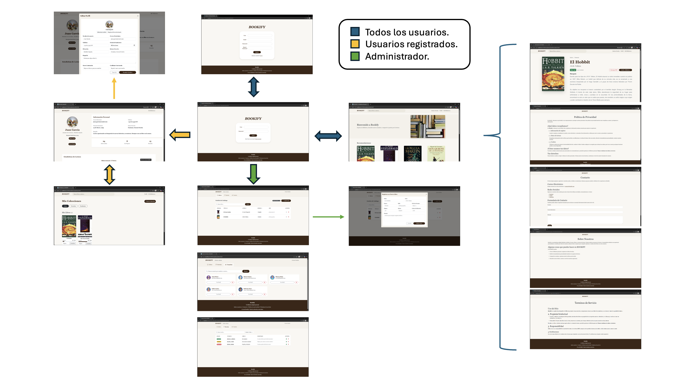

### **Screenshots and Page Descriptions**

#### **1. Main page / Home**
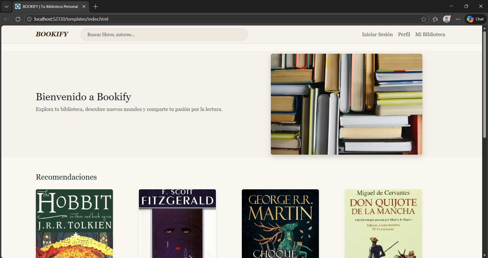

> Home page showing a welcome message, recommended books, and the most-read books at the moment. It includes a navigation bar and access to registration/login for unauthenticated users, as well as access to the personal library. Towards the bottom of the page, you can find contact information, terms, and policies.
#### **2. Log in Page**

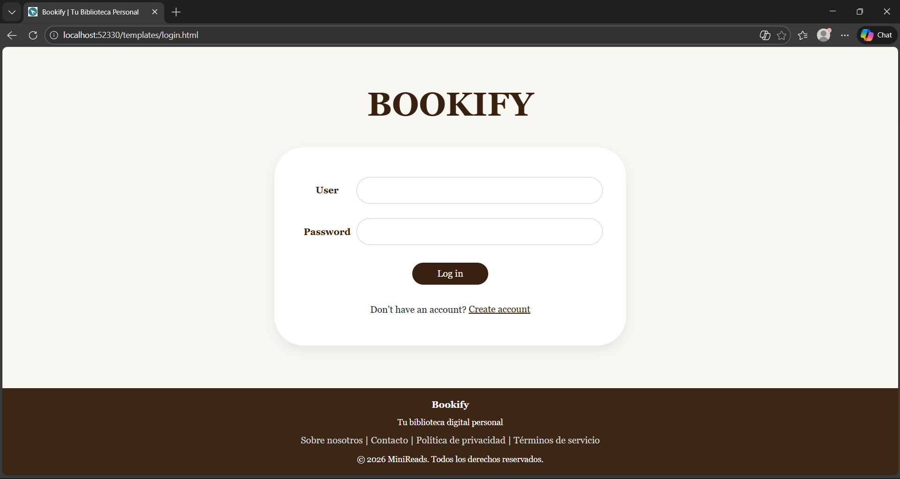

> Login page for registered users. Includes fields to enter username and password, as well as a link to recover the password if forgotten. There is also a link to register if the user does not have an account.
#### **3. Register Page**
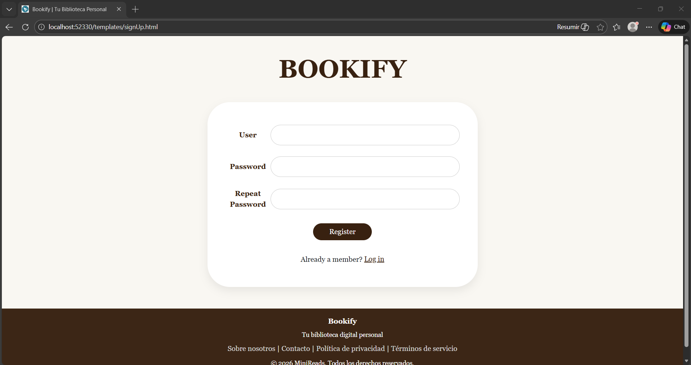
> Registration page for new users. Includes fields to enter username, email, password, and password confirmation. There is also a link to log in if the user already has an account.

#### **4. User Profile Page**
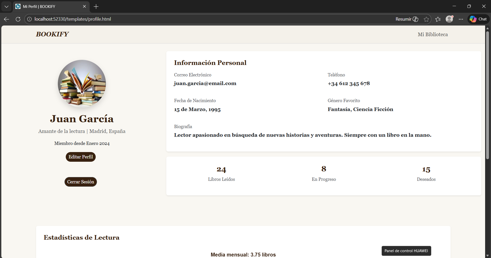
> User profile page showing personal information, reading statistics, and a section to manage collections.
#### **5. My Library Page**
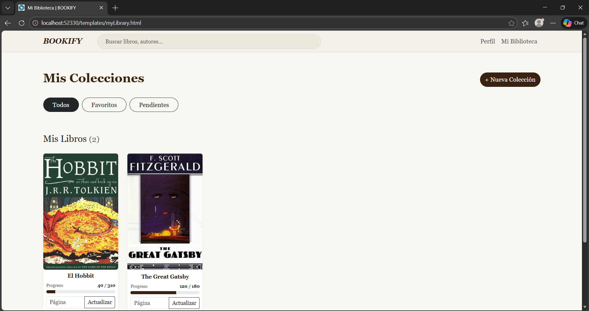
> User's personal library page, where they can view and manage their book collections.

#### **6. Book Description Page**
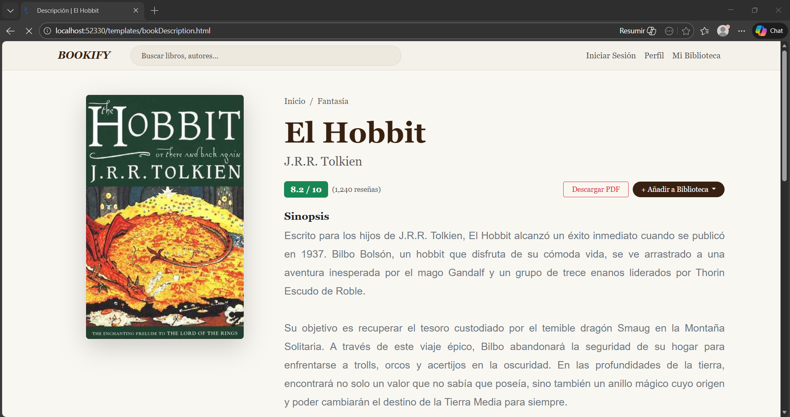
> Description page for a specific book, showing details such as title, author, synopsis, genre, and a user reviews section. It also includes a button to add the book to a personal collection and a star rating system.
#### **7. Admin Panel Page**
> Administration panel page, accessible only to users with an administrator role. Includes sections to manage books, users, and reviews.
##### **7.1 Admin Panel Page - Books**
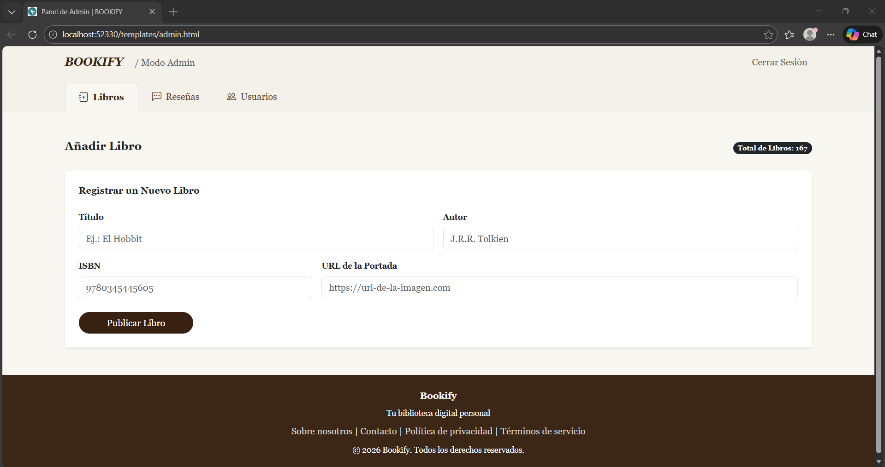
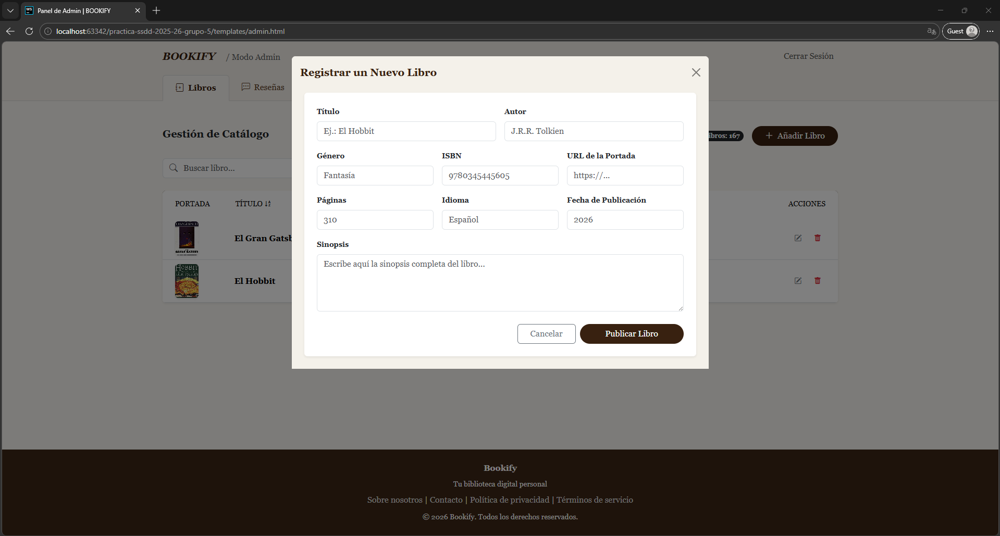

> Book management section, where the administrator can add, edit, or delete books from the catalog. Includes a form to enter book details and a table with the list of registered books.

##### **7.2 Admin Panel Page - Reviews**
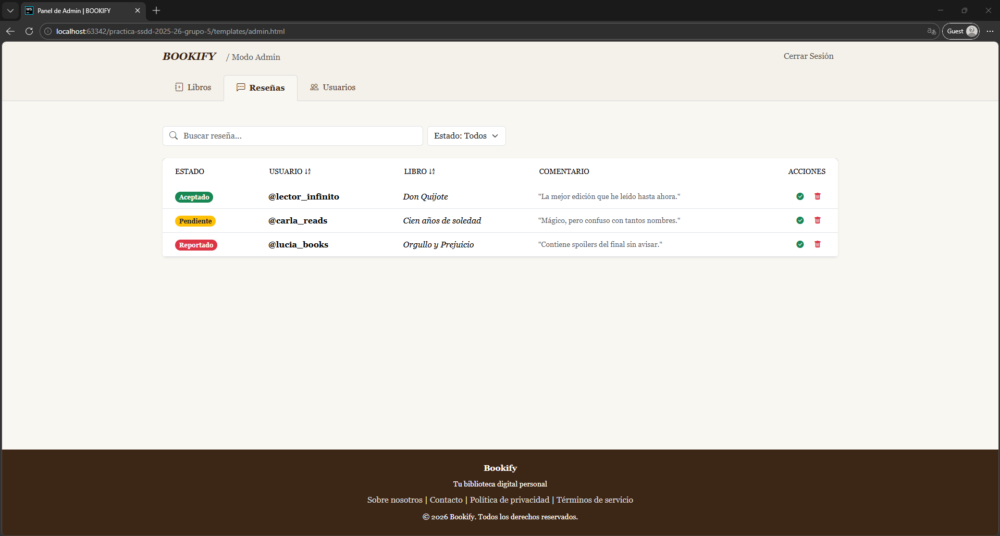
> Review management section, where the administrator can moderate reviews posted by users, deleting those that are inappropriate or violate platform policies. Includes a list of reviews and action options for each.
##### **7.3 Admin Panel Page - Users**
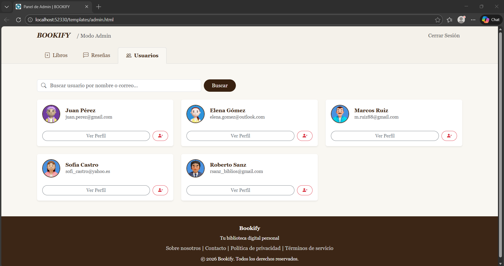
> User management section, where the administrator can view the list of registered users, edit their roles, or delete accounts if necessary. Includes a table with user information and action options.
#### **8. Terms of Service Page**
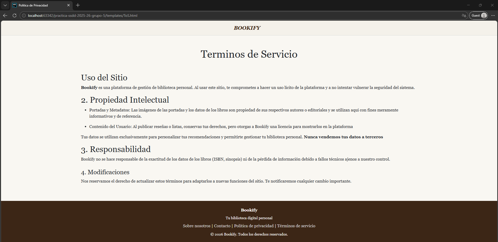
> Terms of Service page detailing the platform's conditions of use, including rights.

#### **9. Privacy Policy Page**
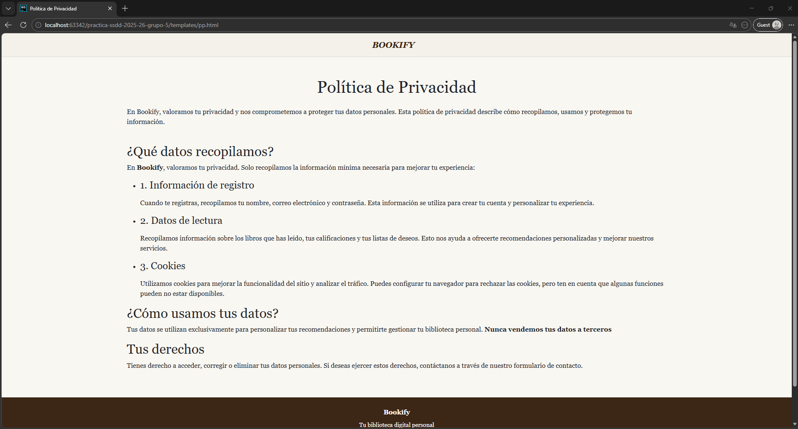
> Privacy Policy page explaining how data is collected, used, and protected.

#### **10. Contact Page**
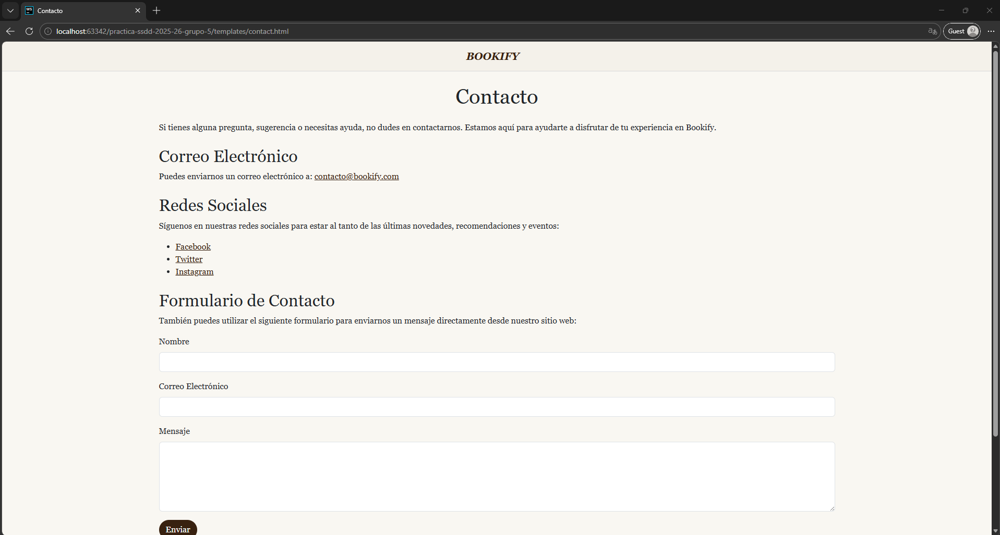
> Contact page providing a form for users to send inquiries or feedback to the team.

#### **11. About us Page**
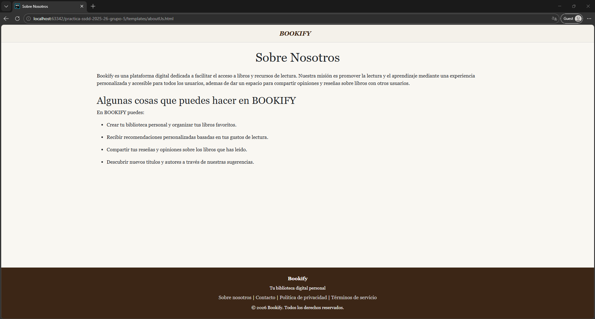
> "About us" page presenting the development team, the project's mission and vision, and any other relevant information regarding the platform's origin and purpose.


### **Member Participation in Practice 1**

#### **Student 1 - Mengying Xia Ruan**

I was responsible for developing the templates for the Book Description, My Library, and Admin sections, including their respective CSS and logic. My work involved building the structure and styling of these modules while implementing key features such as interactive modals for collections, dynamic data visualization via charts, and a real-time progress bar system. I also added several JavaScript functionalities to improve the user experience, like the star rating system and a script to sort tables alphabetically.

| Nº | Commits | Files |
|:---:|:---:|:---:|
| 1 | [Creation and initial structure of the bookDescription.html, bookDescription.css, and reviews.js files](https://github.com/CodeURJC-SSDD-2025-26/practica-ssdd-2025-26-grupo-5/commit/9a6b338505d5798434a661dc49ba9c976d307679) | [bookDescription.html](https://github.com/CodeURJC-SSDD-2025-26/practica-ssdd-2025-26-grupo-5/blob/main/templates/bookDescription.html) <br> [bookDescription.css](https://github.com/CodeURJC-SSDD-2025-26/practica-ssdd-2025-26-grupo-5/blob/main/static/css/bookDescription.css) |
| 2 | [Creation and initial structure of the myLibrary.html and myLibrary.css files](https://github.com/CodeURJC-SSDD-2025-26/practica-ssdd-2025-26-grupo-5/commit/f8039aad8bfa27af9390360d7d2009be09d92250) | [myLibrary.html](https://github.com/CodeURJC-SSDD-2025-26/practica-ssdd-2025-26-grupo-5/blob/main/templates/myLibrary.html) <br> [myLibrary.css](https://github.com/CodeURJC-SSDD-2025-26/practica-ssdd-2025-26-grupo-5/blob/main/static/css/myLibrary.css) |
| 3 | [Creating a modal to create a new collection in the bookDescription file](https://github.com/CodeURJC-SSDD-2025-26/practica-ssdd-2025-26-grupo-5/commit/101712d3d03f80b8f4c86d59b92259e9c07cee73) | [bookDescription.html](https://github.com/CodeURJC-SSDD-2025-26/practica-ssdd-2025-26-grupo-5/blob/main/templates/bookDescription.html) |
| 4 | [Creation of the admin.html and admin.css files. Creation of a general .js file to handle all the charts.](https://github.com/CodeURJC-SSDD-2025-26/practica-ssdd-2025-26-grupo-5/commit/e885385460d47ed63fbd3f6c3f13b80cab656702) | [admin.html](https://github.com/CodeURJC-SSDD-2025-26/practica-ssdd-2025-26-grupo-5/blob/main/templates/admin.html) <br> [admin.css](https://github.com/CodeURJC-SSDD-2025-26/practica-ssdd-2025-26-grupo-5/blob/main/static/css/admin.css) <br> [charts.js](https://github.com/CodeURJC-SSDD-2025-26/practica-ssdd-2025-26-grupo-5/blob/main/static/js/charts.js) |
| 5 | [Updated the comment section, book editing, hyperlinks and JS files for sorting and progress bar](https://github.com/CodeURJC-SSDD-2025-26/practica-ssdd-2025-26-grupo-5/commit/0e06b6f0e8830a6bd89ced2e5c06f8fe158dea55) | [bookDescription.html](https://github.com/CodeURJC-SSDD-2025-26/practica-ssdd-2025-26-grupo-5/blob/main/templates/bookDescription.html) <br> [admin.html](https://github.com/CodeURJC-SSDD-2025-26/practica-ssdd-2025-26-grupo-5/blob/main/templates/admin.html) <br> [admin.js](https://github.com/CodeURJC-SSDD-2025-26/practica-ssdd-2025-26-grupo-5/blob/main/static/js/admin.js) <br> [bookProgress.js](https://github.com/CodeURJC-SSDD-2025-26/practica-ssdd-2025-26-grupo-5/blob/main/static/js/bookProgress.js) <br> [tarRating.js](https://github.com/CodeURJC-SSDD-2025-26/practica-ssdd-2025-26-grupo-5/blob/main/static/js/reviewsStarRating.js) |

---

#### **Student 2 - Jonás Aquiles Huertes Ramírez**

My job was the development and web design of the BOOKIFY application, implementing the main pages (index.html and profile.html) with responsive design using Bootstrap and creating the CSS stylesheets (style.css and profile.css) that define the platform's visual identity. Also, I've done the ToS page and Privacy Policy page.

| Nº    | Commits      | Files      |
|:------------: |:------------:| :------------:|
|1| [Implemented the index.html, where you can see the main web page, as an introduction to the web.](https://github.com/CodeURJC-SSDD-2025-26/practica-ssdd-2025-26-grupo-5/commit/cfde8dfc8a6f5e1e56865e4c0b9f29968d7287cd)  | [index.html](https://github.com/CodeURJC-SSDD-2025-26/practica-ssdd-2025-26-grupo-5/blob/main/templates/index.html)   |
|2| [Add styles, images, and update HTML structure for Bookify](https://github.com/CodeURJC-SSDD-2025-26/practica-ssdd-2025-26-grupo-5/commit/31141b375442edadb2b9dfad0851667fb59c59c0)  | [index.html](https://github.com/CodeURJC-SSDD-2025-26/practica-ssdd-2025-26-grupo-5/blob/main/templates/index.html)   |
|3| [Add profile page with personal information and styling; include profile image and update navbar links](https://github.com/CodeURJC-SSDD-2025-26/practica-ssdd-2025-26-grupo-5/commit/17a9d873756bac0334863fc99d2c4a2975bc78c1)  | [profile.html](https://github.com/CodeURJC-SSDD-2025-26/practica-ssdd-2025-26-grupo-5/blob/main/templates/profile.html)   |
|4| [Added Privacy Policy page where there's a short text that explains how we work in terms of privacy](https://github.com/CodeURJC-SSDD-2025-26/practica-ssdd-2025-26-grupo-5/commit/4703e66021f4e3a17784d0d3e3c51d3259f471d0)  | [pp.html](https://github.com/CodeURJC-SSDD-2025-26/practica-ssdd-2025-26-grupo-5/blob/main/templates/pp.html)   |
|5| [Added Terms of Service page where there's a text that explains how we work and what is the service we provide](https://github.com/CodeURJC-SSDD-2025-26/practica-ssdd-2025-26-grupo-5/commit/4703e66021f4e3a17784d0d3e3c51d3259f471d0)  | [ToS.html](https://github.com/CodeURJC-SSDD-2025-26/practica-ssdd-2025-26-grupo-5/blob/main/templates/ToS.html)   |

---

#### **Student 3 - Adrián Aranda Martínez**

My job was the development of the BOOKIFY login and register pages (login.html and signUp.html) using Bootstrap and their respective css stylesheet (login.css). Also I've done the contact page and the about us page (aboutUs.html and contact.html) with the changes in the css file (style.css).

| Nº    | Commits      | Files      |
|:------------: |:------------:| :------------:|
|1| [Implemented the login page](https://github.com/CodeURJC-SSDD-2025-26/practica-ssdd-2025-26-grupo-5/commit/910767aa94ea7d4e3a9c0fc739b43144f982ac5b)  | [login.html](https://github.com/CodeURJC-SSDD-2025-26/practica-ssdd-2025-26-grupo-5/blob/main/templates/login.html)   |
|2| [Implemented the register page](https://github.com/CodeURJC-SSDD-2025-26/practica-ssdd-2025-26-grupo-5/commit/910767aa94ea7d4e3a9c0fc739b43144f982ac5b)  | [signUp.html](https://github.com/CodeURJC-SSDD-2025-26/practica-ssdd-2025-26-grupo-5/blob/main/templates/signUp.html)   |
|3| [Added the about us page](https://github.com/CodeURJC-SSDD-2025-26/practica-ssdd-2025-26-grupo-5/commit/27c5b33abdd7ebe64dec0ea744a03b874154e083)  | [aboutUs.html](https://github.com/CodeURJC-SSDD-2025-26/practica-ssdd-2025-26-grupo-5/blob/main/templates/aboutUs.html)   |
|4| [Added the contact page](https://github.com/CodeURJC-SSDD-2025-26/practica-ssdd-2025-26-grupo-5/commit/27c5b33abdd7ebe64dec0ea744a03b874154e083)  | [contact.html](https://github.com/CodeURJC-SSDD-2025-26/practica-ssdd-2025-26-grupo-5/blob/main/templates/contact.html)   |

---


## 🛠 **Práctica 2: Web con HTML generado en servidor**

### **Navegación y Capturas de Pantalla**

#### **Diagrama de Navegación**

Solo si ha cambiado.

#### **Capturas de Pantalla Actualizadas**

Solo si han cambiado.

### **Instrucciones de Ejecución**

#### **Requisitos Previos**
- **Java**: versión 21 o superior
- **Maven**: versión 3.8 o superior
- **MySQL**: versión 8.0 o superior
- **Git**: para clonar el repositorio

#### **Pasos para ejecutar la aplicación**

1. **Clonar el repositorio**
   ```bash
   git clone https://github.com/[usuario]/[nombre-repositorio].git
   cd [nombre-repositorio]
   ```

2. **AQUÍ INDICAR LO SIGUIENTES PASOS**

#### **Credenciales de prueba**
- **Usuario Admin**: usuario: `admin`, contraseña: `admin`
- **Usuario Registrado**: usuario: `user`, contraseña: `user`

### **Diagrama de Entidades de Base de Datos**

Diagrama mostrando las entidades, sus campos y relaciones:


> [Descripción opcional: Ej: "El diagrama muestra las 4 entidades principales: Usuario, Producto, Pedido y Categoría, con sus respectivos atributos y relaciones 1:N y N:M."]

### **Diagrama de Clases y Templates**

Diagrama de clases de la aplicación con diferenciación por colores o secciones:


> [Descripción opcional del diagrama y relaciones principales]

### **Participación de Miembros en la Práctica 2**

#### **Alumno 1 - Mengying Xia Ruan**

[Descripción de las tareas y responsabilidades principales del alumno en el proyecto]

| Nº    | Commits      | Files      |
|:------------: |:------------:| :------------:|
|1| [Descripción commit 1](URL_commit_1)  | [Archivo1](URL_archivo_1)   |
|2| [Descripción commit 2](URL_commit_2)  | [Archivo2](URL_archivo_2)   |
|3| [Descripción commit 3](URL_commit_3)  | [Archivo3](URL_archivo_3)   |
|4| [Descripción commit 4](URL_commit_4)  | [Archivo4](URL_archivo_4)   |
|5| [Descripción commit 5](URL_commit_5)  | [Archivo5](URL_archivo_5)   |

---

#### **Alumno 2 - Jonás Aquiles Huertes Ramirez**

[Descripción de las tareas y responsabilidades principales del alumno en el proyecto]

| Nº    | Commits      | Files      |
|:------------: |:------------:| :------------:|
|1| [Descripción commit 1](URL_commit_1)  | [Archivo1](URL_archivo_1)   |
|2| [Descripción commit 2](URL_commit_2)  | [Archivo2](URL_archivo_2)   |
|3| [Descripción commit 3](URL_commit_3)  | [Archivo3](URL_archivo_3)   |
|4| [Descripción commit 4](URL_commit_4)  | [Archivo4](URL_archivo_4)   |
|5| [Descripción commit 5](URL_commit_5)  | [Archivo5](URL_archivo_5)   |

---

#### **Alumno 3 - Adrián Aranda Martínez**

[Descripción de las tareas y responsabilidades principales del alumno en el proyecto]

| Nº    | Commits      | Files      |
|:------------: |:------------:| :------------:|
|1| [Descripción commit 1](URL_commit_1)  | [Archivo1](URL_archivo_1)   |
|2| [Descripción commit 2](URL_commit_2)  | [Archivo2](URL_archivo_2)   |
|3| [Descripción commit 3](URL_commit_3)  | [Archivo3](URL_archivo_3)   |
|4| [Descripción commit 4](URL_commit_4)  | [Archivo4](URL_archivo_4)   |
|5| [Descripción commit 5](URL_commit_5)  | [Archivo5](URL_archivo_5)   |

---


## 🛠 **Práctica 3: API REST, docker y despliegue**

### **Documentación de la API REST**

#### **Especificación OpenAPI**
📄 **[Especificación OpenAPI (YAML)](/api-docs/api-docs.yaml)**

#### **Documentación HTML**
📖 **[Documentación API REST (HTML)](https://raw.githack.com/[usuario]/[repositorio]/main/api-docs/api-docs.html)**

> La documentación de la API REST se encuentra en la carpeta `/api-docs` del repositorio. Se ha generado automáticamente con SpringDoc a partir de las anotaciones en el código Java.

### **Diagrama de Clases y Templates Actualizado**

Diagrama actualizado incluyendo los @RestController y su relación con los @Service compartidos:


### **Instrucciones de Ejecución con Docker**

#### **Requisitos previos:**
- Docker instalado (versión 20.10 o superior)
- Docker Compose instalado (versión 2.0 o superior)

#### **Pasos para ejecutar con docker-compose:**

1. **Clonar el repositorio** (si no lo has hecho ya):
   ```bash
   git clone https://github.com/[usuario]/[repositorio].git
   cd [repositorio]
   ```

2. **AQUÍ LOS SIGUIENTES PASOS**:

### **Construcción de la Imagen Docker**

#### **Requisitos:**
- Docker instalado en el sistema

#### **Pasos para construir y publicar la imagen:**

1. **Navegar al directorio de Docker**:
   ```bash
   cd docker
   ```

2. **AQUÍ LOS SIGUIENTES PASOS**

### **Despliegue en Máquina Virtual**

#### **Requisitos:**
- Acceso a la máquina virtual (SSH)
- Clave privada para autenticación
- Conexión a la red correspondiente o VPN configurada

#### **Pasos para desplegar:**

1. **Conectar a la máquina virtual**:
   ```bash
   ssh -i [ruta/a/clave.key] [usuario]@[IP-o-dominio-VM]
   ```
   
   Ejemplo:
   ```bash
   ssh -i ssh-keys/app.key vmuser@10.100.139.XXX
   ```

2. **AQUÍ LOS SIGUIENTES PASOS**:

### **URL de la Aplicación Desplegada**

🌐 **URL de acceso**: `https://[nombre-app].etsii.urjc.es:8443`

#### **Credenciales de Usuarios de Ejemplo**

| Rol | Usuario | Contraseña |
|:---|:---|:---|
| Administrador | admin | admin123 |
| Usuario Registrado | user1 | user123 |
| Usuario Registrado | user2 | user123 |

### **OTRA DOCUMENTACIÓN ADICIONAL REQUERIDA EN LA PRÁCTICA**

### **Participación de Miembros en la Práctica 3**

#### **Alumno 1 - Mengying Xia Ruan**

[Descripción de las tareas y responsabilidades principales del alumno en el proyecto]

| Nº    | Commits      | Files      |
|:------------: |:------------:| :------------:|
|1| [Descripción commit 1](URL_commit_1)  | [Archivo1](URL_archivo_1)   |
|2| [Descripción commit 2](URL_commit_2)  | [Archivo2](URL_archivo_2)   |
|3| [Descripción commit 3](URL_commit_3)  | [Archivo3](URL_archivo_3)   |
|4| [Descripción commit 4](URL_commit_4)  | [Archivo4](URL_archivo_4)   |
|5| [Descripción commit 5](URL_commit_5)  | [Archivo5](URL_archivo_5)   |

---

#### **Alumno 2 - Jonás Aquiles Huertes Ramirez**

[Descripción de las tareas y responsabilidades principales del alumno en el proyecto]

| Nº    | Commits      | Files      |
|:------------: |:------------:| :------------:|
|1| [Descripción commit 1](URL_commit_1)  | [Archivo1](URL_archivo_1)   |
|2| [Descripción commit 2](URL_commit_2)  | [Archivo2](URL_archivo_2)   |
|3| [Descripción commit 3](URL_commit_3)  | [Archivo3](URL_archivo_3)   |
|4| [Descripción commit 4](URL_commit_4)  | [Archivo4](URL_archivo_4)   |
|5| [Descripción commit 5](URL_commit_5)  | [Archivo5](URL_archivo_5)   |

---

#### **Alumno 3 - Adrián Aranda Martínez**

[Descripción de las tareas y responsabilidades principales del alumno en el proyecto]

| Nº    | Commits      | Files      |
|:------------: |:------------:| :------------:|
|1| [Descripción commit 1](URL_commit_1)  | [Archivo1](URL_archivo_1)   |
|2| [Descripción commit 2](URL_commit_2)  | [Archivo2](URL_archivo_2)   |
|3| [Descripción commit 3](URL_commit_3)  | [Archivo3](URL_archivo_3)   |
|4| [Descripción commit 4](URL_commit_4)  | [Archivo4](URL_archivo_4)   |
|5| [Descripción commit 5](URL_commit_5)  | [Archivo5](URL_archivo_5)   |

---
